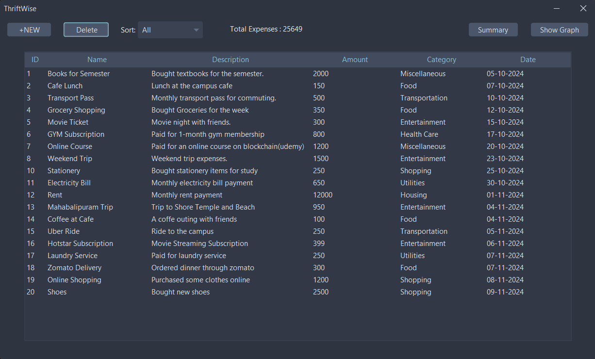

# ThriftWise

ThriftWise is a Java application that allows you to track and manage your expenses. It's built with Java Swing for the GUI, FlatLaf for a modern look and feel, and SQLite DB for data persistence.

## Screenshots

### Main Screen


### Categories


### Summary


### Expense Summary with Graph


## Features

- Add new expenses
- Sort expenses based on categories
- Provides a summary of total expenses
- Visual representation of expenses using pie charts (new feature)

## Future Developments

- Implement delete functionality for expenses
- Further improvements in expense visualizations
- Exporting expense data as CSV/Excel files

## Prerequisites

- Java 17 or later (Make sure both `JAVA_HOME` and `Path` variables are set.)
- Maven

## Getting Started

Follow these steps to get the project up and running on your local machine:

1. Clone the repository:
   ```bash
   git clone https://github.com/Surya-KN/ThriftWise.git
   ```

2. Navigate to the project directory:
    ```bash
    cd ThriftWise
    ```

3. Build the project:
    - For Windows
    ```bash
      .\mvnw.cmd clean package
    ```
    - For Linux
    ```bash
      chmod +x ./mvnw
      ./mvnw clean package
    ```

4. Run the application:
    ```bash 
      java -jar target/ThriftWise-1.0-jar-with-dependencies.jar
    ```

## Contributing

Contributions are welcome! Please feel free to submit a pull request.