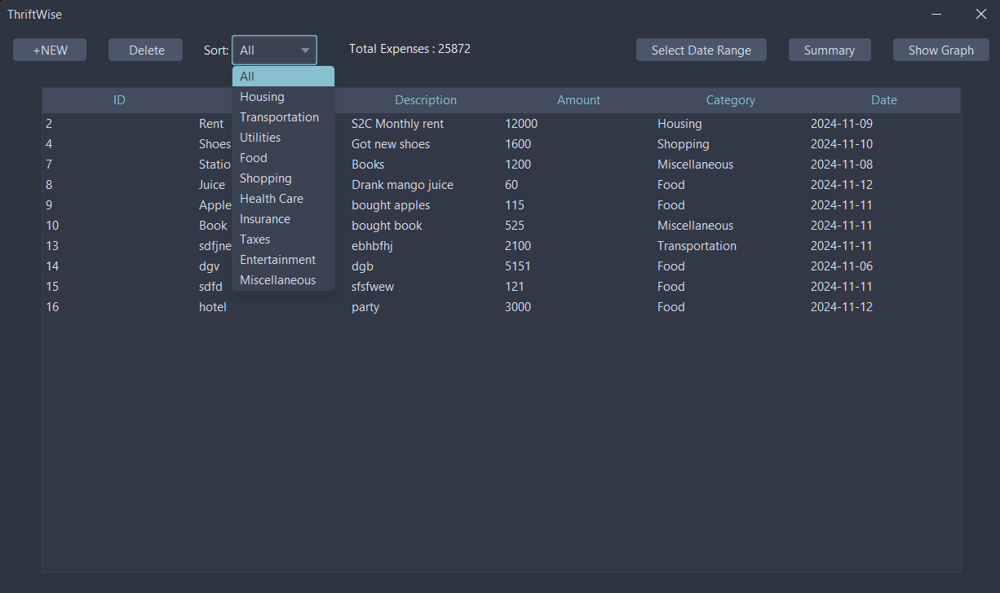
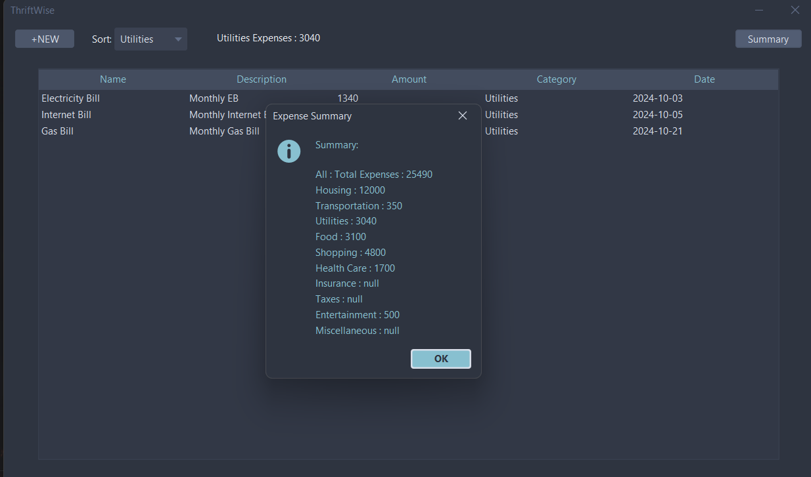

# ThriftWise

ThriftWise is a Java application that allows you to track and manage your expenses. It's built with Java Swing for the GUI, FlatLaf for a modern look and feel, and SQLite DB for data persistence.

## Screenshots

### Main Screen


### Categories


### Summary


### Date Range


### Expense Summary with Graph


### Expense Summary with BarGraph


## Features

- **Add New Expenses**: Add expenses with details such as name, description, amount, date, and category.
- **Delete Expenses**: Delete expenses directly from the table based on their unique ID.
- **Calendar Date Picker**: Use a calendar to select the expense date instead of typing it manually.
- **Sort Expenses**: Sort expenses based on categories.
- **Expense Summary**: View a summary of total expenses in each category.
- **Expense Graph**: Visualize expenses in a pie chart or bar chart for better insights into spending patterns.
- **Date Range Filtering**: View transactions within a specific date range by selecting start and end dates.

## Technologies Used

- **Java Swing**: For the graphical user interface.
- **FlatLaf**: A modern, sleek look and feel for the application.
- **SQLite**: Lightweight database for storing expenses.
- **JFreeChart**: For generating the expense summary pie chart and bar chart.
- **JDateChooser**: For selecting date ranges.

## Future Developments

- **Export Data**: Allow exporting expense data to CSV or Excel files.
- **Improved Visualizations**: More graph types for analyzing spending trends.

## Prerequisites

- Java 17 or later (Make sure both `JAVA_HOME` and `Path` variables are set.)
- Maven

## Getting Started

Follow these steps to get the project up and running on your local machine:

1. Clone the repository:
   ```bash
   git clone https://github.com/Surya-KN/ThriftWise.git
   ```

2. Navigate to the project directory:
    ```bash
    cd ThriftWise
    ```

3. Build the project:
    - For Windows
    ```bash
      .\mvnw.cmd clean package
    ```
    - For Linux
    ```bash
      chmod +x ./mvnw
      ./mvnw clean package
    ```

4. Run the application:
    ```bash 
      java -jar target/ThriftWise-1.0-jar-with-dependencies.jar
    ```

## Contributing

Contributions are welcome! Please feel free to submit a pull request.